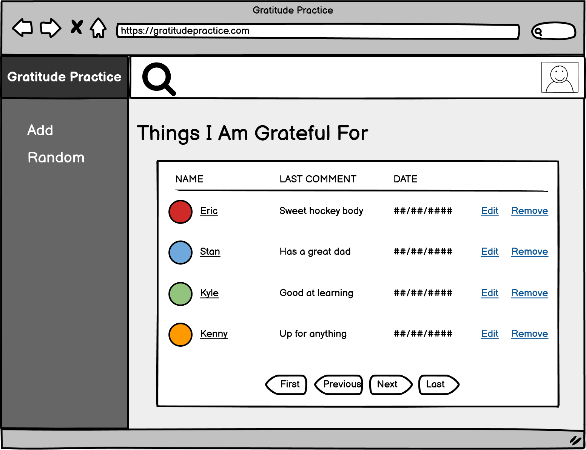

# Guided_Side_App

<!-- The idea has been documented in a short paragraph in MD -->
## Why am I making this?
I have been practicing Mindfulness lately and one of the parts that I need to be more diligant on is practicing gratitude. I am creating a web application where users can logon and add things they are grateful for, such as people, places, memories or whatever and they can write different things about it. Users will be able also see all the things they have previously added and they will be able to add, update and delete their entries.

Privacy is important as the logged in user should feel secure knowing that no other user is able to see their data. 

<!-- A Trello board has been created and a link is included in your readme. -->
## Trello Board
[Trello Board for Guided Side App](https://trello.com/b/XEhDTn6a/guided-side-app)

<!-- Create some User Stories -->
## User Stories
- As a user I want to sign up
- As a user I want to log in
- As a user I want to add/edit/remove things I am grateful for
- As a user I want to add/edit/remove comments to things I am grateful for
- As a user I want to have all my things be private from other users
- As a user I want to view a list of all the things I have added before
- As a user I want to view a random thing I am grateful for when I login
- As a user I want to add images to things I am grateful for
- As a user I want to enable 2FA 
- As a user I want to search for things I am grateful for

## Wireframes
**User Dashboard** -- *Route:* / when a user is logged in

